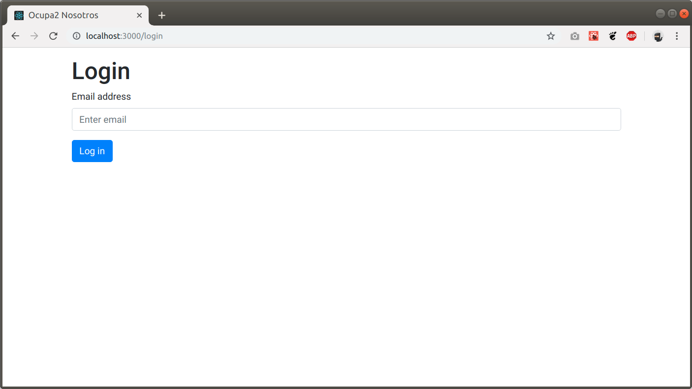
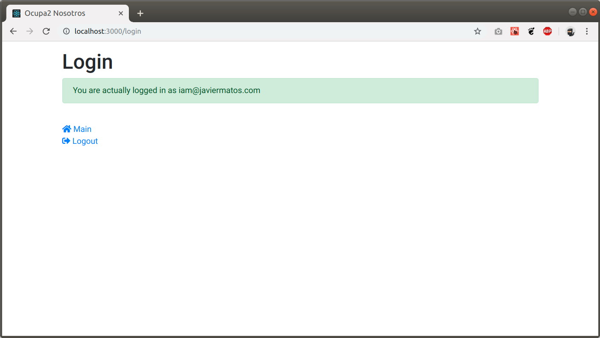
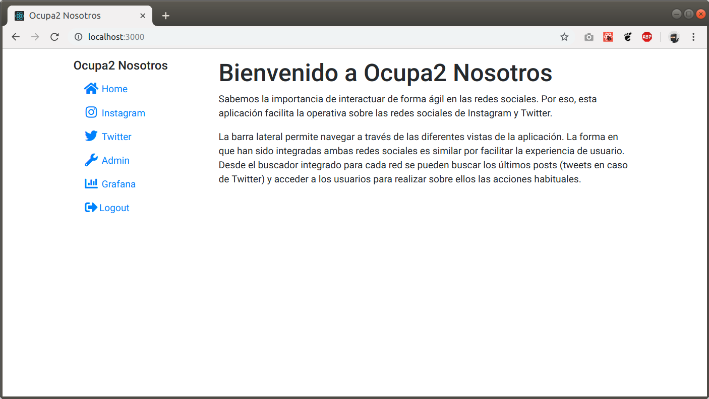
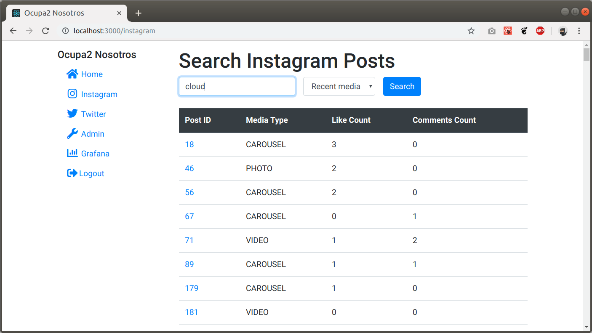
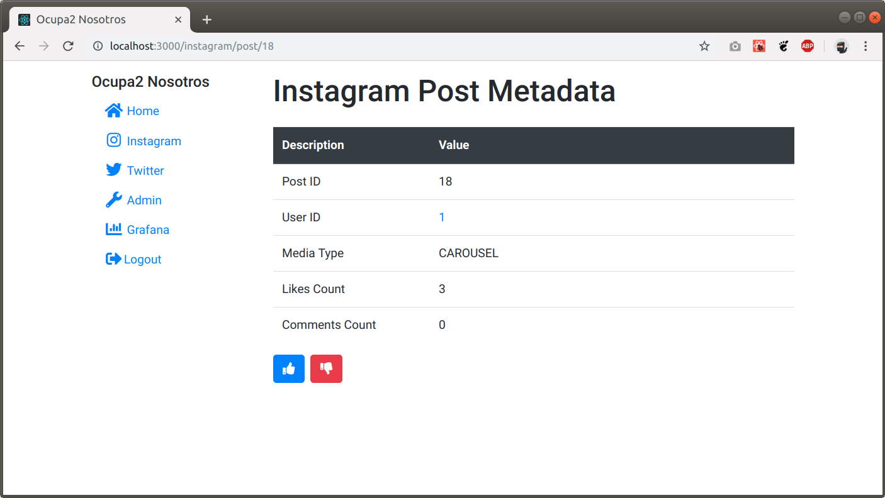
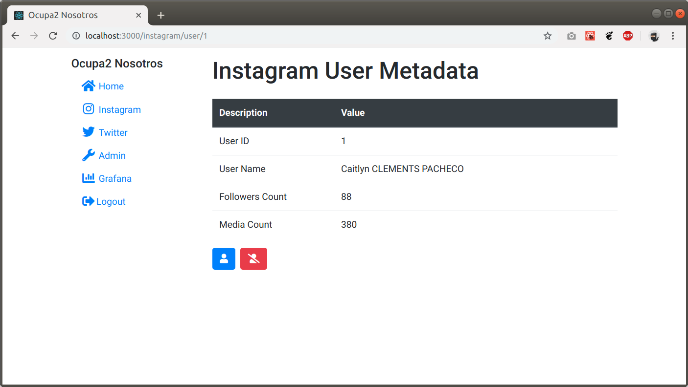
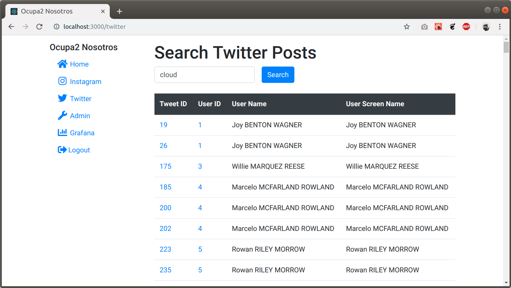
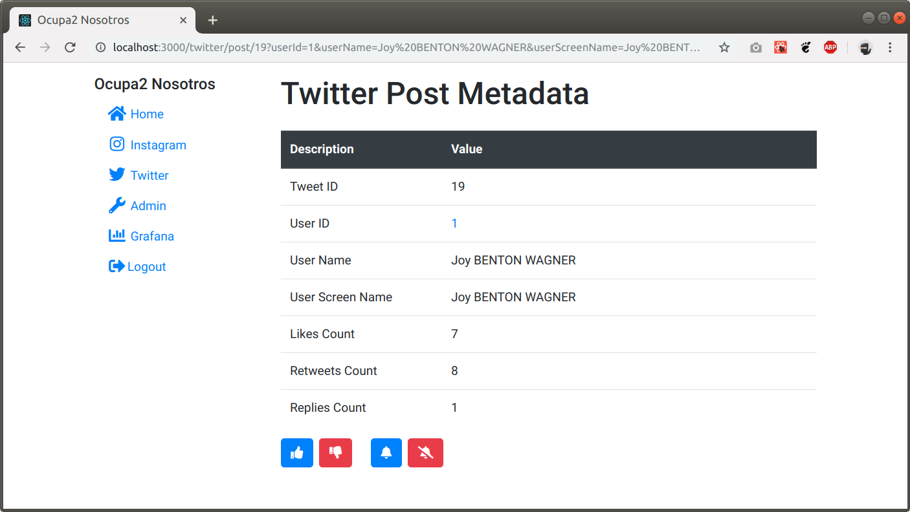
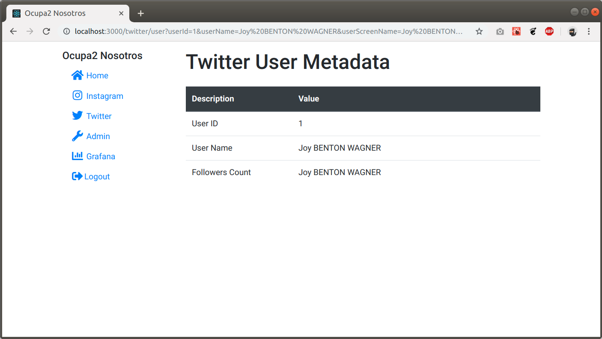

# Reto redes sociales

Esta aplicación serverless implementa toda la funcionalidad necesaria para realizar la operativa que se solicitaba en
los retos relativos a las redes sociales, tanto Instagram como Twitter.

Accesible desde http://ocupa2.javiermatos.com

## Sobre el stack tecnológico

Para implementar esta aplicación hemos optado por utilizar la biblioteca React. Además de esta biblioteca acompañamos
al proyecto de otras bibliotecas necesarias para realizar las demás acciones propias de una interfaz de usuario.

## Utilización de la aplicación

Podemos hacer login en la aplicación con nuestro email y si todo ha ido bien, entonces obtendremos api keys para las
dos redes sociales utilizando nuestra dirección de email.

Una vez accedemos con éxito, vamos al panel principal pulsando en el enlace hacia Main.

Desde la vista principal podremos utilizar el menú lateral para nevegar hacia las otras opciones.

### Instagram

Búsqueda en Instagram. Hay que utilizar alguna etiqueta válida, pues de lo contrario nos muestra que no ha encontrado
ningún resultado. Luego de la búsqueda tendremos acceso a través de los enlaces hacia el resto de vistas que muestran
información más en detalle sobre los posts y los usuarios. Todas las acciones del documento PDF relativas al reto han
sido implementadas.

### Twitter

La sección dedicada a Twitter es análoga a aquella de Instagram.

### Sobre CORS

Dado que es una aplicación serverless, intentamos llamar directamente al servidor que proponía el resto, pero la
restricción CORS fue un problema. Para solucionar eso utilizamos un proxy que desplegamos en una máquina propia
utilizando nginx y [locals-cors-proxy](https://github.com/garmeeh/local-cors-proxy).

### Notas

Este proyecto ha sido realizado por Javier Matos para presentar al Hackathon de Ocupa2.
